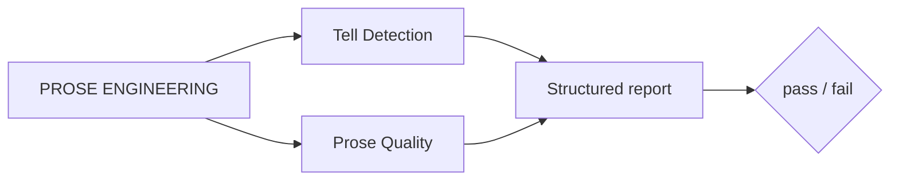
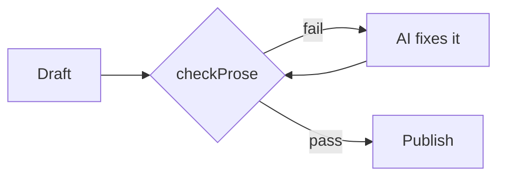

# PROSE Engineering for Better Copy ⭐


### Programmatic Rules for Optimized Style & Expression

<table>
<colgroup>
<col style="width:55%">
<col style="width:45%">
</colgroup>
<tr>
<th>Before (Writing skills only)</th>
<th>After (Writing skills + PROSE)</th>
</tr>
<tr>
<td>In today's fast-paced content landscape, stop being your own copy editor — it's not about writing more, it's about writing smarter, so you can seamlessly unlock a workflow that empowers you to focus on what truly matters.</td>
<td><strong>Get better copy than you already have.</strong></td>
</tr>
</table>

</details>

## How Prose Engineering Works

Every AI copywriting tool makes the same promise: better copy.
What they don't tell you is that the model writing is also the model
checking itself.

So YOU become the quality check. You re-read the copy, you ask for a
revision. You read it again, on and on.

**While AI can miss details, a programmatic check doesn't.**



### Every draft is checked by code:

- **Does it sound human?** RegEx tests for tell-tale phrases, hedge stacks and patterns
  that read as machine-written.
- **Does it read well?** Natural Language Processing checks for Readability, sentence variety and passive voice.

#### Style specific checks

| Style | Code checks |
| --- | --- |
| Meta ad | Character limits per field, a real call to action,  claims that can get an ad account suspended |
| Landing page | A headline and a call to action, proof, and paragraphs short enough to read on a phone |
| Sales page or email | A call to action, at least one specific number, and no filler benefit claims |
| Post for X | The 280-character limit counted the way X counts it, hashtags, and engagement bait |

## The Prose Engineering Loop

If either check fails, the draft goes back to the AI to fix automatically,
with no rereading on your part, and runs through the checks again until it
passes.



**What you read is what already passed.**

## Why Prose Engineering Works

Normal AI writing fails because the writer is the checker.

We built the quality checks into code instead of trusting the model's
opinion of itself. The model writes, the rules judge, and the loop fixes.

It also catches what reading alone misses:

- A post can be well written and
still be 60% over the character limit.
- An ad can be well written and
still promise something that gets the account banned.

Prose Engineering catches things even a human can miss.


## Easy to install and use

Ask your agent:
*"Install Prose Engeering, then help me write about ..."*

<details>
<summary>For your agent</summary>

```
npx @skyf0xx/hedgehog init --copywriting
```

Answer a short set of questions about what you're writing and who it's
for. The finished piece (an article, a Meta ad, a landing page, a sales
page, a post for X) lands in your current folder, already checked.

Technical details: [ARCHITECTURE.md](ARCHITECTURE.md)
